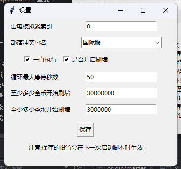
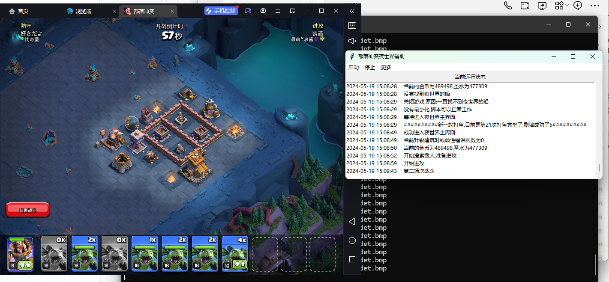

# 部落冲突夜世界自动化突袭和刷钱辅助
**辅助交流群675162515，刚建群，人数较少，欢迎加入**

**2025-1-23正常可用**
  
## 家乡打鱼辅助测试版（实验性功能）
0. 下载https://qilishidai.lanzoub.com/irBth2lghwuj
家乡打鱼源码将在本项目star数超过50时开源，永久免费使用。
1. 让当前支持超级野蛮人打鱼，必须有超级野蛮人
2. 必须添加信任目录后解压
3. 调试代码没改好，直接打开会报错，需要在雷电多开器创建多一个模拟器才可以正常打开辅助
4. 其他注意事项和夜市界辅助一样

## 当前夜市界辅助使用方法
  

1. 安装雷电模拟器 [雷电模拟器官网](https://www.ldmnq.com/)
2. 设置模拟器分辨率为宽800、高600、dpi160（重要）。
3. windows系统设置中缩放改为100%（重要）
4. 在模拟器中安装部落冲突并登录你的账号，确保进入**夜世界**。
5. 部落冲突中设置配兵推荐全亡灵（或在下兵界面能显示兵种数量的兵种），目前还未写其它兵种判断（偷懒）。

6. 运行辅助(下面1,2选一个)
   1. 快速运行(推荐)
   
   下载[辅助](https://github.com/qilishidai/ClashOfClansResourceRaid/releases/tag/v2.0.6)解压后运行main.exe

   2. 源码运行(非必要)

   - 安装 Python，并执行以下命令安装依赖
   ```shell
          pip install pywin32
          pip install psutil
   ```
   - 在cmd窗口中执行：
      ```shell
      python main.py   
      ```


7. 点击菜单栏中的“更多”选项，然后选择“设置”，进行所需的设置。
8. 点击菜单栏中的“启动”选项开始挂机。

### 设置选项说明
- `雷电模拟器索引`：用于指定在雷电多开器中选择的模拟器，多开器页面的第一个模拟器索引为0，第二个为1。
- `部落冲突包名`：指定部落冲突的包名，可以是国服或国际服。
- `一直执行`：设置为True则脚本会持续执行，设置为False则根据`需要执行多少秒`变量确定运行时间。
- `需要执行多少秒`：如果`一直执行`设置为False，脚本将在设定的秒数后停止运行。
- `是否开启刷墙`：设置为True则开启刷墙功能，否则关闭。
- `循环最大等待秒数`：设定每个循环的最大等待秒数。
- `至少多少金币开始刷墙`：设置刷墙功能的金币阈值。
- `至少多少圣水开始刷墙`：设置刷墙功能的圣水阈值。

### 编译为exe
```shell
pyinstaller --noconsole --exclude-module=cv2 main.py
```
然后将源码的资源文件复制到`dist\main`目录下，main.exe即为可执行文件。

#### 注意
1. 使用过程中模拟器不可以最小化，但可以被其它窗口遮挡。如果不小心最小化了，脚本一段时间后会自动矫正，无需担心。
2. 使用过程中不可以随意操作模拟器，以免影响脚本运行。


如果你有任何问题，可以联系作者 QQ：2105758776。

---


### 第三方库
1. [OP(operator & open)](https://github.com/WallBreaker2/op)

### 其他

#### 更新记录
2025年1月23日
1. 修复国服更新后不下兵问题
2. 发布一个exe版本

2024年9月27日
1. 更新readme注意事项
2. 修复一直打开进攻页面失败

2024年7月31日
1. 增加打开出兵页面识别的判断。
2. 增加main.pyw入口，系统配置好python环境即可双击打开辅助，添加到快捷方式后更加方便（python环境可以参考本文**拓展用法**）。
3. 修复关闭刷墙导致报错的问题

2024年7月26日
1. 修复刷墙时脚本滑动和点击实现问题。

2024年7月25日
1. 后台模式截图的opengl模式，可支持隐藏模拟器运行（在菜单栏选择“更多-隐藏模拟器”）。
2. 重写键盘和鼠标操作类，修复模式opengl后台操作失效的问题。

### 已知待修复问题
1. 无法最小化模拟器运行，只可以通过操作界面隐藏模拟器。
2. 有时会无法正常检测进入夜世界，目前可以通过重启模拟器或辅助解决。
3. ~~触发开始战斗后，有时由于模拟器卡顿还在基地，需要图色判断，但不影响使用，日后修复~~（7月31日已修复）。
4. 国服刷墙问题
